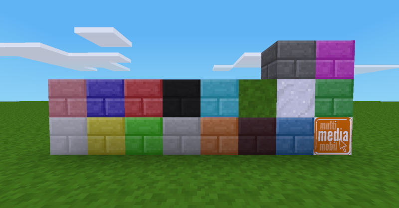

# Coloured stone bricks

This is a fork of the mod »[colouredstonebricks](https://github.com/davisonio/colouredstonebricks)« from Craig Davison.

------------------

This mod contains decorative blocks which would look nice on any building or creation. The fork adds grass and snow as textures.

## Install

Download & unzip the mod, rename it to »colouredstonebricks« and move it into your `minetest/mods` folder.

###### Requirements

- [Minetest](http://www.minetest.net) >= 5.1.0
- default (included in the Game »[minetest_game](https://content.minetest.net/packages/Minetest/minetest_game/)«)
- dye (included in the Game »[minetest_game](https://content.minetest.net/packages/Minetest/minetest_game/)«)

###### Optional depends

- stairsplus (included in the mod »[moreblocks](https://content.minetest.net/packages/Calinou/moreblocks/)«)

## Authors

**[Craig Davison](https://davison.io)**

## License & Credits

Unless otherwise stated:

- Copyright © 2014+ [Craig Davison](https://davison.io). Released under the [WTFPL](http://www.wtfpl.net/txt/copying/).
